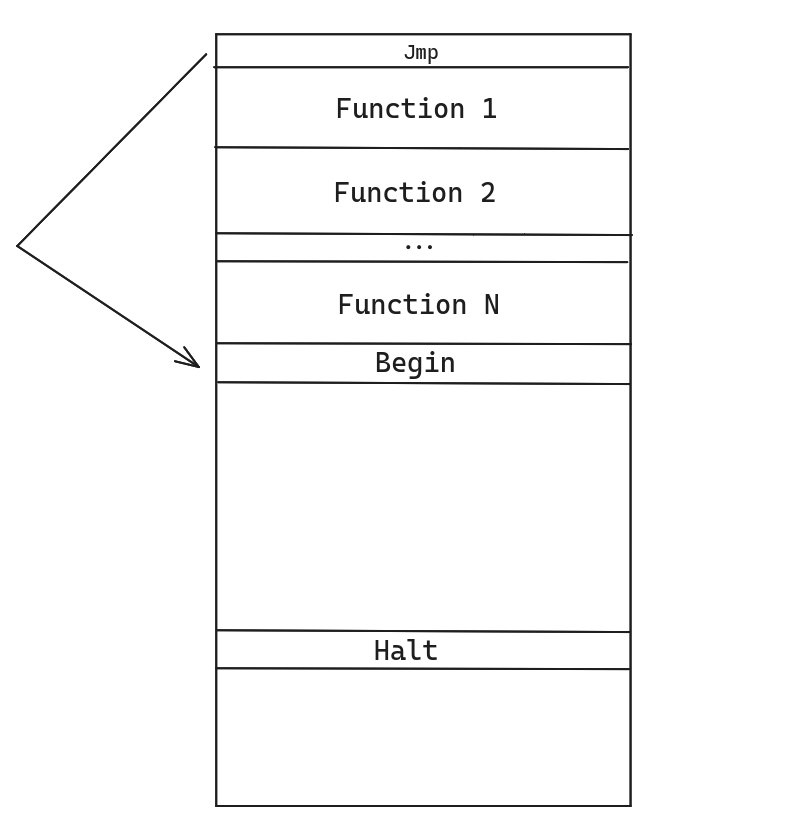
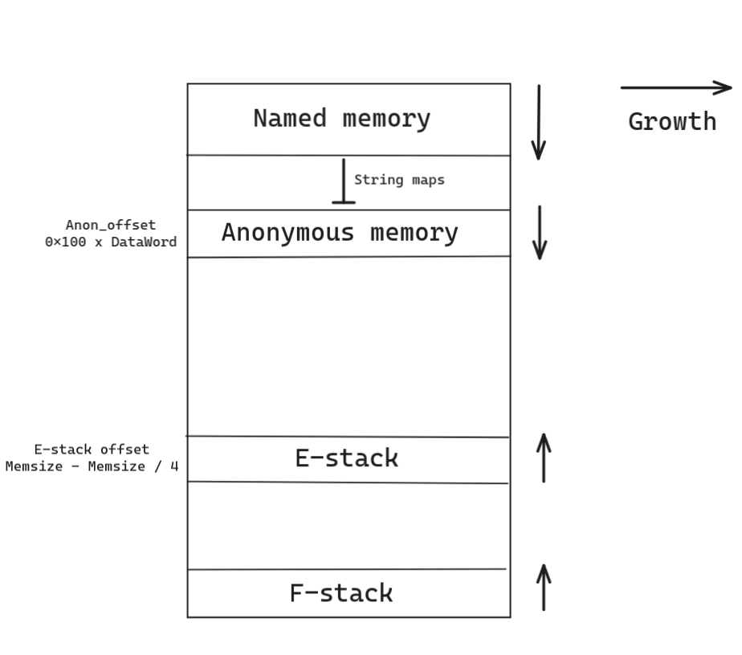
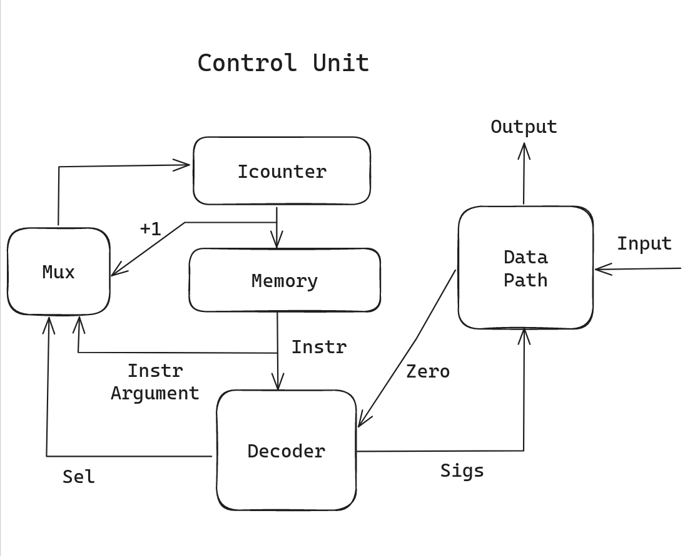
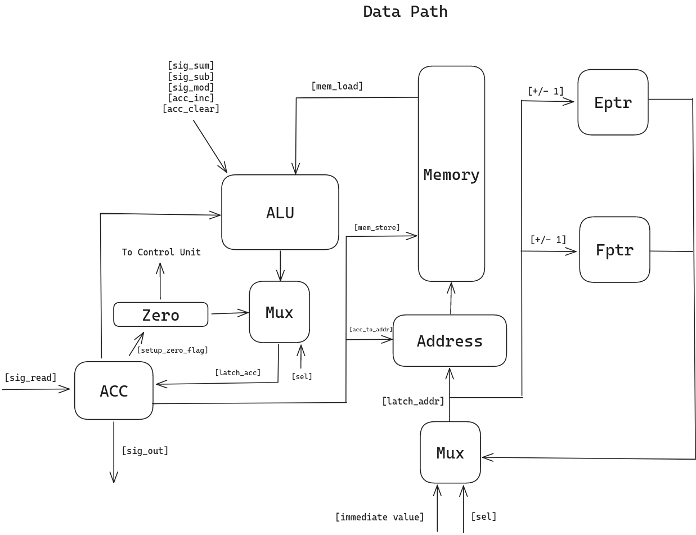

Шпренгер Константин Александрович. P33091\
Вариант: lisp | acc | harv | hw | instr | binary | stream | port | cstr | prob5 | [4]char\
Усложнение: Отсутствует

# Language

## Syntax
```
program ::= s-expression

s-expression ::= atomic-symbol 
               | "(" s-expresssion " " s-expression ")" 

atomic-symbol ::= control-symbol
                | number
                | letter
                | atomic-symbol atomic-symbol

control-symbol ::= "==" 
                 | "-" 
                 | "+" 
                 | "%" 
                 | "loop" 
                 | "defun" 
                 | "if" 
                 | "nop"
                 | "break"
                 | "fucall"
                 | "read"
                 | "set"

letter ::= "a" | "b" | ... | "z" | """

number ::= "0" | "1" | ... | "9"

```

## Semantics

## Scopes
+ Global (performed by "define" keyword)
+ Local (ISA preserves writes, currently only reads)

## Evaluation stategy
- Every string (constant ar names) is passed by a pointer
- Every number is passed by value
- Each s-expression evaluates after all insides are evaluated
- Passing args into function call only by value
- Applicative order
  (except "%" operation due to E-stack organization)

### Varialbles
+ `(define var_name (s-exp))` -> Define global var with s-exp value

### Operations
- `(set (val) (s-exp))` -> set result of (s-exp) to variable (var) 
- `(print (s-exp))` -> print result of (s-exp)
- `(== (numb-ret s-exp) (numb-ret s-exp))` -> compare operands values and return result
- `(+, -, % (numb-ret s-exp) (numb-ret s-exp))` -> (add, substract, mod) and return result

### Execution stream control
- `(if (base s-exp) (then s-exp) (else s-exp))` -> if result of (base s-exp) is "positive" evaluate `(then s-exp)` else evaluate `(else s-exp)`. "Positive" means it either string or non-zero number.
- `(loop ([s-exp]))` -> sequentially evalueate s-expressions and return last's value
- `(break (s-exp))` -> yield from loop with `(s-exp)` value
- `(nop)`

### Functions 
+ Definition: `(defun func_name (arg) ([s-exp]))`
+ Calling: `(fucall func_name arg)`, returns value as s-expression

### I/O
- `(print (str-ret s-exp))` -> print value of string-returning s-exp
- `(read var_name)` -> read string into var

## Memory

### Instruction Memory
- Word size - 16 bit
- Word count - 1024
- Sequential placing in translation time


### Data memory
+ Word size - 32 bit
+ Word count - 1024
+ "Named memory" stands for variables in global scope (numbers and string pointers)
+ "Anonymous memory" contains constants and "Named memory" string's bodies
+ "E-stack" - stack for s-exp returning values
+ "F-stack" - stack for exclusively functions calls (ret + arg)
+ Sequential placing in translation time


### Registers
- E-stack pointer - 32 bit
- F-stack pointer - 32 bit
- Accumulator - 32 bit
- Address register (Ar) - 32 bit

## ISA

### Instruction set

+ Machine word - 32 bit signed

| INSTRUCTION   |   HEX         | DESCRIPTION                                                       |
|:--------------|:--------------|:------------------------------------------------------------------|   
| NOP           | 1000          | Just nop                                                          |
| HALT          | 1100          | Stop execution                                                    |
| CMP           | 1200          | CMP accumulator value with zero and setup zero flag               |      
| FPUSH         | 1300          | Place accumulator value on top of F-stack                         |  
| FPOP          | 1400          | Pop F-stack top value into accumulator                            |     
| EPUSH         | 1500          | Place accumulator value on top of E-stack                         |
| EPOP          | 1600          | Pop E-stack top value into accumulator                            |
| ZERO          | 1700          | Load zero flag into accumulator                                   |     
| RET           | 1800          | FPOP + JMP                                                        |
| CLEAR         | 1900          | Set 0x0000 ass accumulator value                                  |
| ADD           | 1A00          | Acc = Acc + [E-stack ptr]                                         |
| SUB           | 1B00          | Acc = Acc - [E-stack ptr]                                         |    
| MOD           | 1F00          | Acc = Acc % [E-stack ptr]                                         |
| READ          | 1C00          | Read next symbol from input buffer into accumulator               |
| PRINT         | 1D00          | Print symbol from accumulator                                     |
| INCESTACK     | 1E00          | [E-stack ptr] += 1                                                |     
| LOAD `<addr>` | AXXX          | Load by address in instruction / (F/E)-Stack / Ar + fetch address |
| STORE `<addr>`| BXXX          | Store by address in instruction / (F/E)-Stack / Ar + fetch address|
| CALL `<addr>` | CXXX          | FPUSH + JMP                                                       |
| JZ `<addr>`   | EXXX          | if zero flag = 1 then jump to addr                                |
| JMP `<addr>`  | FXXX          | jump to addr                                                      |
`<addr>` - Direct access to instruction memory or (in case of LOAD/STORE): 
- A8XX/B8XX - F-stack
- A4XX/B8XX - E-stack
- ACXX/B8XX - Ar register

## Translator

### Command line inteface
`translator.py <source_file> <target_instruction_file> <target_mnemonic_file> <target_data_file>`

Modules: [Translator](./translator.py)
         [Parsing functions](./parsing.py)

### Code generation
1. Translation into python lists with terms, () -> []
2. Recursive reducing with applicative order
3. Repeating second step

### Rules
1. Implicit check of keywords and number of params  
2. Each keyword mapped to its instruction set
2. Breaks should be recursively inside loop expression

## Machine

### Command line inteface
`machine.py <source_instruction_file> <source_data_file> <source_input_file>`

Module: [Machine](./machine.py)

### Scheme
Control Unit:


Signals:
+ `tick` - increment Icounter value

Data Path:


Signals:
- `latch_set_zero` - set zero flag depending on acc value
- `latch_addr` - latching data address using Opcode selector and implicit address (if needed)
- `sig_write` - store acc value into memory
- `latch_acc`- latching accumulator using Opcode selector
- `acc_inc` - increment accumulator
- `clear_acc` - set `0x0000` as acc value
- `setup_zero_flag` - set zero flag depending on acc's value
- `sig_sum` - perform `add` operation
- `sig_sub` - perform `sub` operation
- `sig_mod` - perform `mod` operation
- `sig_out` - append acc value to output buffer
- `sig_read` - read next symbol from input buffer into accumulator
- `sig_acc_to_addr` - store acc's value to Ar 
- `mem_store` store acc value into memory by address specified in Ar
- `mem_load` load memory value by address specified in Ar into acc

Model's Features:
+ Checking main memory violation
+ Unlimited execution time
+ using `$` as buffer end (golden test problem)

## Testing
### Golden tests
- [Cat](./golden/cat.yml) - Print Input Buffer values
- [Hello User](./golden/user.yml) - Print "Hello [user]", where [user] - input buffer value
- [Hello World!](./golden/world.yml) - Print "Hello, World!"
- [Problem 5](./golden/prob_5.yml) - Solve Problem №5, and compare result with two values. Then print True and False due to comparison.
- [Just](./golden/just.yml) - Compare values of two global variables and print out string due to this comparison
### CI
Using raw python docker image
```yaml
image: python:3.10

ci:
  stage: test
  script:
    - pip install poetry
    - poetry install
    - poetry run ruff format --check .
    - poetry run ruff check .
    - poetry run coverage run -m pytest --verbose
```

### Exaple using `Just` test:
```shell
╭─bakalover@bakalover-laptop ~/code/carch  ‹master*› 
╰─➤  python3.10 translator.py in/source.txt binary/instructions out/mnemonics.txt binary/data
╭─bakalover@bakalover-laptop ~/code/carch  ‹master*› 
╰─➤  python3.10 machine.py binary/instructions binary/data in/input.txt
DEBUG:root:Icounter:   0 MemAddr:   0 Acc: 0, Zero: 0, Estack: 768, Fstack: 1024 
Next instruction: f001
DEBUG:root:Icounter:   1 MemAddr:   0 Acc: 0, Zero: 0, Estack: 768, Fstack: 1024 
Next instruction: a000
DEBUG:root:Icounter:   2 MemAddr:   1 Acc: 1, Zero: 0, Estack: 768, Fstack: 1024 
Next instruction: 1500
DEBUG:root:Icounter:   3 MemAddr: 767 Acc: 1, Zero: 0, Estack: 767, Fstack: 1024 
Next instruction: a001
DEBUG:root:Icounter:   4 MemAddr:   2 Acc: 2, Zero: 0, Estack: 767, Fstack: 1024 
Next instruction: 1500
DEBUG:root:Icounter:   5 MemAddr: 766 Acc: 2, Zero: 0, Estack: 766, Fstack: 1024 
Next instruction: 1600
DEBUG:root:Icounter:   6 MemAddr: 766 Acc: 2, Zero: 0, Estack: 767, Fstack: 1024 
Next instruction: 1b00
DEBUG:root:Icounter:   7 MemAddr: 767 Acc: 1, Zero: 0, Estack: 767, Fstack: 1024 
Next instruction: 1700
DEBUG:root:Icounter:   8 MemAddr: 767 Acc: 0, Zero: 0, Estack: 767, Fstack: 1024 
Next instruction: b400
DEBUG:root:Icounter:   9 MemAddr: 767 Acc: 0, Zero: 0, Estack: 767, Fstack: 1024 
Next instruction: 1600
DEBUG:root:Icounter:  10 MemAddr: 767 Acc: 0, Zero: 0, Estack: 768, Fstack: 1024 
Next instruction: 1200
DEBUG:root:Icounter:  11 MemAddr: 767 Acc: 0, Zero: 1, Estack: 768, Fstack: 1024 
Next instruction: e00f
DEBUG:root:Icounter:  15 MemAddr: 767 Acc: 0, Zero: 1, Estack: 768, Fstack: 1024 
Next instruction: a10c
DEBUG:root:Icounter:  16 MemAddr: 269 Acc: 269, Zero: 1, Estack: 768, Fstack: 1024 
Next instruction: 1500
DEBUG:root:Icounter:  17 MemAddr: 767 Acc: 269, Zero: 1, Estack: 767, Fstack: 1024 
Next instruction: a400
DEBUG:root:Icounter:  18 MemAddr: 269 Acc: 269, Zero: 1, Estack: 767, Fstack: 1024 
Next instruction: ac00
DEBUG:root:Icounter:  19 MemAddr:  70 Acc: 70, Zero: 1, Estack: 767, Fstack: 1024 
Next instruction: 1200
DEBUG:root:Icounter:  20 MemAddr:  70 Acc: 70, Zero: 0, Estack: 767, Fstack: 1024 
Next instruction: e018
DEBUG:root:Icounter:  21 MemAddr:  70 Acc: 70, Zero: 0, Estack: 767, Fstack: 1024 
Next instruction: 1d00
DEBUG:root:Icounter:  22 MemAddr:  70 Acc: 70, Zero: 0, Estack: 767, Fstack: 1024 
Next instruction: 1e00
DEBUG:root:Icounter:  23 MemAddr: 767 Acc: 270, Zero: 0, Estack: 767, Fstack: 1024 
Next instruction: f011
DEBUG:root:Icounter:  17 MemAddr: 767 Acc: 270, Zero: 0, Estack: 767, Fstack: 1024 
Next instruction: a400
DEBUG:root:Icounter:  18 MemAddr: 270 Acc: 270, Zero: 0, Estack: 767, Fstack: 1024 
Next instruction: ac00
DEBUG:root:Icounter:  19 MemAddr:   0 Acc: 0, Zero: 0, Estack: 767, Fstack: 1024 
Next instruction: 1200
DEBUG:root:Icounter:  20 MemAddr:   0 Acc: 0, Zero: 1, Estack: 767, Fstack: 1024 
Next instruction: e018
DEBUG:root:Icounter:  24 MemAddr:   0 Acc: 0, Zero: 1, Estack: 767, Fstack: 1024 
Next instruction: 1600
DEBUG:root:Icounter:  25 MemAddr: 767 Acc: 270, Zero: 1, Estack: 768, Fstack: 1024 
Next instruction: 1100
['F']
```

Output mnemonics:
```
0 - 0xf001 - [<Opcode.JMP: '0xF000'>, 1, 0]
1 - 0xa000 - [<Opcode.LOAD: '0xA000'>, 'x', 0]
2 - 0x1500 - [<Opcode.EPUSH: '0x1500'>, None, 0]
3 - 0xa001 - [<Opcode.LOAD: '0xA000'>, 'y', 0]
4 - 0x1500 - [<Opcode.EPUSH: '0x1500'>, None, 0]
5 - 0x1600 - [<Opcode.EPOP: '0x1600'>, None, 0]
6 - 0x1b00 - [<Opcode.SUB: '0x1B00'>, None, 0]
7 - 0x1700 - [<Opcode.ZERO: '0x1700'>, None, 0]
8 - 0xb400 - [<Opcode.STORE: '0xB000'>, <Data.EStack: 4>, 0]
9 - 0x1600 - [<Opcode.EPOP: '0x1600'>, None, 0]
10 - 0x1200 - [<Opcode.CMP: '0x1200'>, None, 0]
11 - 0xe00f - [<Opcode.JZ: '0xE000'>, 15, 0]
12 - 0xa100 - [<Opcode.LOAD: '0xA000'>, 256, 0]
13 - 0x1500 - [<Opcode.EPUSH: '0x1500'>, None, 0]
14 - 0xf011 - [<Opcode.JMP: '0xF000'>, 17, 0]
15 - 0xa10c - [<Opcode.LOAD: '0xA000'>, 268, 0]
16 - 0x1500 - [<Opcode.EPUSH: '0x1500'>, None, 0]
17 - 0xa400 - [<Opcode.LOAD: '0xA000'>, <Data.EStack: 4>, 0]
18 - 0xac00 - [<Opcode.LOAD: '0xA000'>, <Data.Ar: 5>, 0]
19 - 0x1200 - [<Opcode.CMP: '0x1200'>, None, 0]
20 - 0xe018 - [<Opcode.JZ: '0xE000'>, 24, 0]
21 - 0x1d00 - [<Opcode.PRINT: '0x1D00'>, None, 0]
22 - 0x1e00 - [<Opcode.INCESTACK: '0x1E00'>, None, 0]
23 - 0xf011 - [<Opcode.JMP: '0xF000'>, 17, 0]
24 - 0x1600 - [<Opcode.EPOP: '0x1600'>, None, 0]
25 - 0x1100 - [<Opcode.HALT: '0x1100'>, None, 0]
```


### Running All tests:

```shell
╭─bakalover@bakalover-laptop ~/code/carch  ‹master*› 
╰─➤  poetry run coverage run -m pytest --verbose
====================================== test session starts =======================================
platform linux -- Python 3.10.12, pytest-7.4.3, pluggy-1.3.0 -- /home/bakalover/.cache/pypoetry/virtualenvs/carch-NgvUq6rw-py3.10/bin/python
cachedir: .pytest_cache
rootdir: /home/bakalover/code/carch
configfile: pyproject.toml
plugins: golden-0.2.2
collected 5 items                                                                                

integration_test.py::test_user[golden/just.yml] PASSED                                     [ 20%]
integration_test.py::test_user[golden/user.yml] PASSED                                     [ 40%]
integration_test.py::test_user[golden/prob_5.yml] PASSED                                   [ 60%]
integration_test.py::test_user[golden/world.yml] PASSED                                    [ 80%]
integration_test.py::test_user[golden/cat.yml] PASSED                                      [100%]
```

## Statistics
| Шпренгер Консатнтин Александрович | Just         | 3  | 52 | 26 | 26  | 43
| Шпренгер Консатнтин Александрович | Cat          | 3  | 48 | 24 | 171 | 315
| Шпренгер Консатнтин Александрович | Hello, World | 24 | 12 | 92 | 170 | 315


